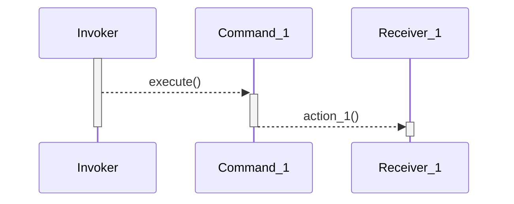

Command pattern is a pattern in which an object is used to encapsulate all the required information to perform an action or trigger an event at a later time. Four terms always associated with the command pattern are:
- **command**: knows about **receiver** and invokes a method of the receiver. Values for parameters of the receiver method are stored in the command as well. The receiver object is also stored in the command by aggregation.
- **receiver**: does the work when the `execute()` method in **command** is called.
- **invoker**: knows how to execute a **command**, and optionally does bookkeeping about the command execution. It does not know anything about a concrete command, it knows only about the command _interface_.
- **client**: holds the **command**, **receiver**, and **invoker** objects. It decides which receiver object is assigned to which command object, and which command object is assigned to which invoker object. The client also decides which commands are executed, and at which time.

