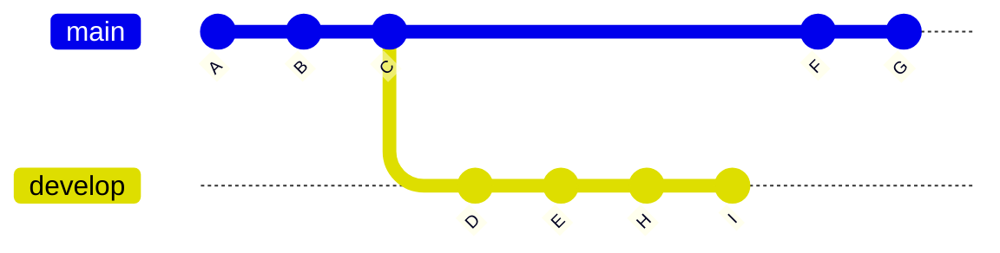
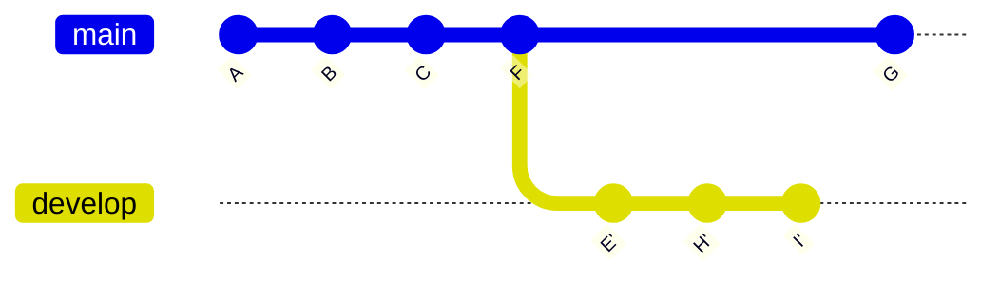

## Rebase `--onto`
### Before

### Command
```
git rebase --onto F D develop
```

In words, that is:

_rebase the history of the ref `develop` such that the children of commit `D` are based onto commit `F`_

> **Note**
> If the reference (`develop` in this example) is omitted, the current HEAD will be used instead

> **Note**
> Passing `I` as reference has a different result: the branch develop will remain intact, with a new detached HEAD being created at commit `I'`
### After

> **Note**
> Note that commits `E`, `H`, and `I`, have been rewritten as  `E'`, `H'`, and `I'`

