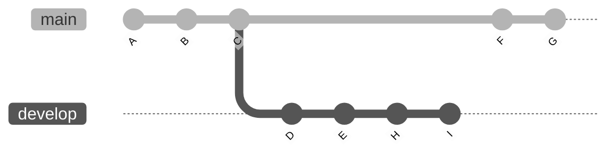
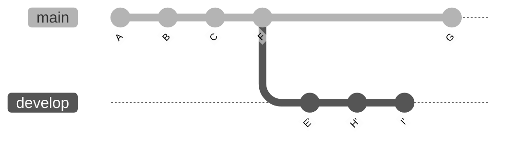
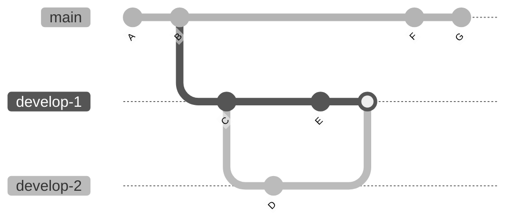
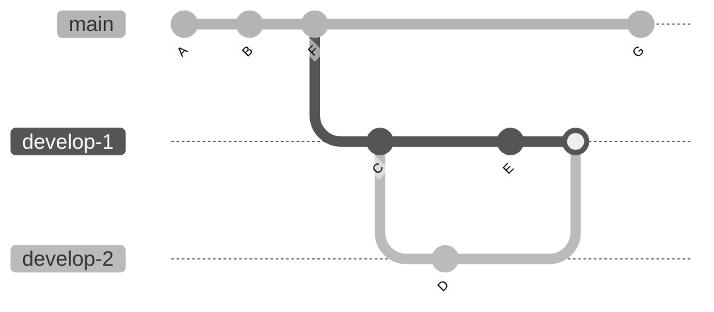

# Rebase 

## `--onto` #git

The `--onto` flag can be used to specify which commit should be used as branching point. Given a git history like this:


We can rebase the history of the branch/ref `develop` such that commit `D` is substituted by commit `F` with the command:

```
git rebase --onto F D develop
```

This will result in an updated git history that looks like this:

> **Note**
> Commits `E`, `H`, and `I`, have been rewritten as  `E'`, `H'`, and `I'` and commit `D` has disappeared

> **Note**
> If the reference (`develop` in this example) is omitted, the current HEAD will be used instead

> **Note**
> Passing `I` as reference has a different result: the branch develop will remain intact, with a new detached HEAD being created at commit `I'`
## `--rebase-merges` #git

The `--rebase-merges` flag can be used to keep and rebase merges as well. Starting from a git history like this:


Rebasing commit `B` in `develop-1` onto `F` in `main` with the `--rebase-merges` flag will give:


