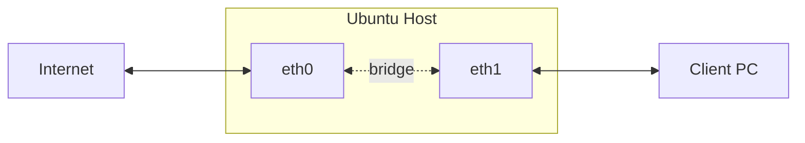

In summary:
- `eth0`: the network adapter with internet (external or WAN).  
- `eth1`: the network adapter to which a second computer is attached (internal or LAN).  
- `192.168.0.x`: IP sub-net for `eth1`

## Configure NAT

Configure `iptables` for NAT translation so that packets can be correctly routed through the Ubuntu gateway.
```bash
sudo iptables -A FORWARD -o eth0 -i eth1 -s 192.168.0.0/24 -m conntrack --ctstate NEW -j ACCEPT
sudo iptables -A FORWARD -m conntrack --ctstate ESTABLISHED,RELATED -j ACCEPT
sudo iptables -t nat -F POSTROUTING
sudo iptables -t nat -A POSTROUTING -o eth0 -j MASQUERADE
```
The first rule allows forwarded packets (initial ones). The second rule allows forwarding of established connection packets (and those related to ones that started). The third rule does the NAT.

`iptables` settings need to be set-up at each boot (they are not saved automatically), with the following commands:
1. Save the `iptables`:
```bash
sudo iptables-save | sudo tee /etc/iptables.sav
```
2. Edit `/etc/rc.local` and add the following lines before the "exit 0" line:
```bash
iptables-restore < /etc/iptables.sav
```
## Enable routing

1. Configure the gateway for routing between two interfaces by enabling IP forwarding:
```bash
sudo sh -c "echo 1 > /proc/sys/net/ipv4/ip_forward"
```
2. Edit `/etc/sysctl.conf` and uncomment:
```
net.ipv4.ip_forward=1
```

## Add routes to other devices
To ensure that the client PC is reachable from the network, other host will need a new routing rule to forward all traffic through the gateway:
```bash
sudo ip route add 192.168.0.0/24 via <eth0-address>
```